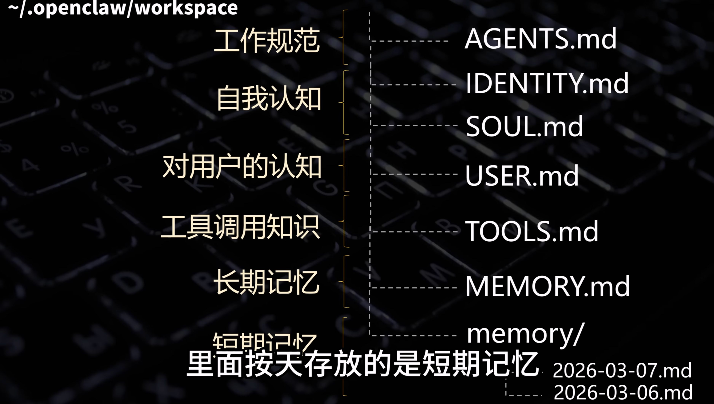

# OpenClaw 的真正架构（源码级）

OpenClaw本质是一个 self-hosted agent runtime + message router。

换句话说：

OpenClaw ≠ AI
OpenClaw = agent OS

完整系统结构：

                  ┌──────────────────┐
                  │ Messaging Apps   │
                  │ Slack / Telegram │
                  │ WhatsApp / CLI   │
                  └─────────┬────────┘
                            │
                      Gateway Router
                            │
                            ▼
                 ┌────────────────────┐
                 │   Agent Runtime    │
                 │  (LLM + Planner)   │
                 └─────────┬──────────┘
                           │
        ┌──────────────────┼──────────────────┐
        │                  │                  │
      Tools             Memory            Scheduler
  browser / shell       markdown           cron
  http / python         json               heartbeat


核心组件其实只有 5 个模块：

1️⃣ Gateway
2️⃣ Agent loop
3️⃣ Tool executor
4️⃣ Memory store
5️⃣ Scheduler


# 关键模块拆解

## 1️⃣ Gateway

负责：

接收 Slack / WhatsApp / CLI 消息

统一转成 agent event

底层通常是：

WebSocket server

负责节点通信和状态同步。

## 2️⃣ Agent Runtime

核心逻辑：

LLM loop

流程：

message
→ LLM reasoning
→ tool call
→ result
→ next reasoning

这就是著名的：
```
ReAct loop
```

LLM 会：
- 推理
- 调用工具
- 再推理

直到完成任务。

## 3️⃣ Tool Execution

OpenClaw 给 LLM “手”。

典型工具：
```
file.read
file.write
shell.exec
browser.open
http.get
calendar.create
```

LLM 输出：
```
{
 "tool": "shell.exec",
 "args": { "cmd": "git pull" }
}
```

runtime 执行。

## 4️⃣ Memory System

OpenClaw memory 非常简单：
```
markdown
json
filesystem
```

workspace 是唯一上下文：

```
workspace/
  memory.md
  soul.md
  tasks/
  logs/
```

Agent 所有上下文来自这里。



## 5️⃣ Scheduler

OpenClaw 有 heartbeat / cron system。

例如：
```
08:00 summarize news
12:00 check emails
18:00 schedule reminders
```
这让 agent 变成：
```
always-running system
```
而不是 chatbot。

Heartbeats:
1. 读取 HEARTBEATS.md 中的任务清单
2. 逐项检查
3. 有需要通知你的事情就发消息
4. 没事就安静不做任何处理

Heartbeat vs Cron:
| 维度 | Heartbeat | Cron |
| --- | --- | --- |
| 触发方式 | 固定间隔 | 精确时间 |
| 上下文 | 有完整对话历史 | 独立执行，无上下文 |
| 适合 | 情感维系，闲聊（复杂上下文任务） | 定时提醒（简单精确的小任务） |


# OpenClaw 为什么这么简单却 powerful

很多人第一次看源码会惊讶：

怎么只有几千行代码？

原因是：

OpenClaw 没有实现复杂 AI 系统。

它只实现：

LLM loop
tool calling
memory
scheduler

其他复杂部分：

planning
reasoning
workflow

全部交给：

LLM

这就是 LLM-native architecture。


# OpenClaw 和 Kubernetes 的类比

这个类比非常重要。

很多人第一次看到 OpenClaw 会意识到：

Agent ecosystem = container ecosystem (2014)

对比：

Container world | Agent world
Docker | Agent runtime
Kubernetes | Multi-agent orchestration
Containers | Agents
Microservices | Tools

OpenClaw 就像：
```
Docker for AI agents
```

负责：
```
agent lifecycle
tool runtime
state management
automation
```


# 为什么 OpenClaw 会突然爆红

其实不是技术突破。

而是数个设计决策同时成立。

## 1 messaging UI

OpenClaw UI：
```
Telegram
WhatsApp
Discord
```
而不是：
```
web dashboard
```
所以 adoption 非常快。


## 2 persistent agent

传统 AI：
```
request → response
```
OpenClaw：
```
always running
```
这就是：
```
digital employee
```

而达到这一点，让它看起来像是 autonomous，根本上是因为它支持 5 类输入：
1. messages
2. heartbeats
3. crons
4. hooks
5. webhooks
Bonus: agents can message other agents


## 3 tools - shell access

The agent now can get access to the whole system.


## 4 local-first

OpenClaw：

self hosted

所以用户感觉：

my personal AI


# OpenClaw 的最大问题（很多人忽略）

OpenClaw 本质上：

LLM + shell access

安全风险巨大。

因为 agent 可以：

read files
run commands
access tokens
send messages

安全研究指出：

prompt injection

credential leakage

malicious skills

这些问题在 autonomous agent 中非常常见。

甚至最近发现一个漏洞：

攻击者可通过 WebSocket brute-force 密码

接管 agent runtime


# 推荐阅读
1️⃣
OpenClaw architecture overview
https://ppaolo.substack.com/p/openclaw-system-architecture-overview

2️⃣
How OpenClaw works
https://bibek-poudel.medium.com/how-openclaw-works-understanding-ai-agents-through-a-real-architecture-5d59cc7a4764

3️⃣
DigitalOcean deep dive
https://www.digitalocean.com/resources/articles/what-is-openclaw
